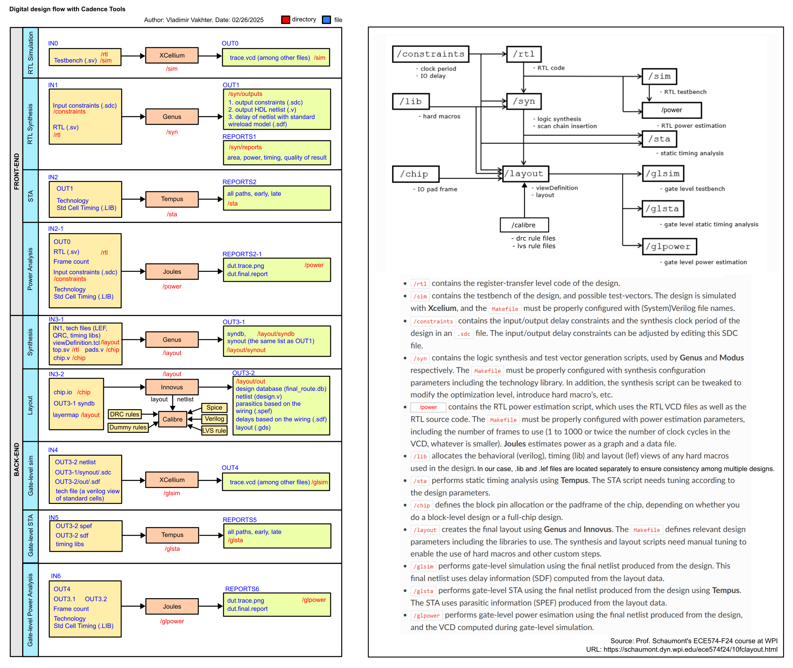
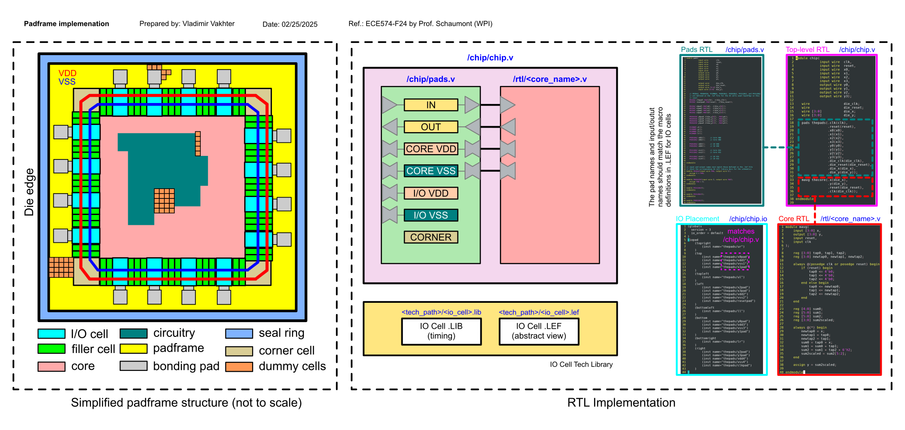

# Important notes on non-disclosure and proprietary files

This repository contains proprietary files and information that are subject to non-disclosure agreements. Please adhere to the following guidelines:
1. **Non-Disclosure**: Do not share or distribute proprietary files or information within this repository without explicit permission. This includes any files that are marked as confidential or proprietary.
2. **Modifications Required for Open Source**: If you intend to make this repository open-source, ensure that all proprietary content is removed or modified to comply with licensing and non-disclosure agreements. 
3. **Commit History**: Before making this repository public, removing sensitive information from the commit history is essential. 

By following these guidelines, you help protect the integrity and confidentiality of the proprietary information contained in this repository.

# About
* The project implements a moving average logic block layout using the Cadence digital design flow.
* This example project is based on the one presented in ECE574-F24 "Advanced Digital Systems Design" course (by [Prof. Schaumont](mailto:pschaumont@wpi.edu)).
* The original project has been modified and adapted for TSMC180nm_3V and setup for the `cadence-uguler` server.

# Toolset
* The design has been tested with the following tools:
	- by Cadence: XCELIUM1903 / GENUS211 / SSV231 / JLS211 / INNOVUS211 / QUANTUS221
	- by Siemens (formerly, by Mentor Graphics): Calibre v2023.4_39.23
* To set the paths, check this `.bashrc` [example](https://github.com/icaslab/cadence_uguler_bashrc_example/releases/tag/v1.0).
* Read more about .bashrc` [here](https://icaslab.wpi.edu/wiki/doku.php?id=paths_to_ic_tools).

# Project tree
Multiple directories correspond to different steps of the digital IC design. This folder organization is usually recommended to keep the workspace organized when working with the Cadence digital flow. Inside each folder, except for the ```rtl``` directory (which only contains the Verilog or SystemVerilog script), you will find a Makefile and some TCL scripts for that step. This structure helps keep the design flow organized. Also since multiple stages of the flow are interconnected, it is highly recommended not to change this project file structure.

The file tree below reflects the order of execution (go from top to bottom, `cd` to each subdirectory, and do `make <command from Makefile>`).

```
############################################################################################################
# General-purpose files
############################################################################################################

├── README.md
├── .gitignore

############################################################################################################
# Front-end
############################################################################################################

├── rtl                                - RTL design files
│   └── mavg.v
├── sim                                - RTL simulation (functional verification)
│   ├── Makefile                       
│   └── tb.v
├── syn                                - RTL synthesis
│   ├── Makefile
│   └── run_genus.tcl
└── sta                                - Post-synthesis static timing analysis (STA)
│   ├── Makefile
│   └── run_tempus.tcl
├── power                              - (Early) RTL power consumption estimation
│   ├── Makefile
│   └── run_joules.tcl

############################################################################################################
# Back-end
############################################################################################################

├── chip				- Chip planning
│   ├── padframe
│   |	├── chip.v				- top-level RTL
|   |	├── pads.v				- pads RTL
|   |	└── chip.io				- I/O ports assignment/placement
│   └── no_padframe 
│   	└── chip.io
├── calibre				- Calibre rule files for dummy metal and OD/PO insertion
│   ├── padframe
|   |  	├── drc					- DRC
|   |	└── dummy_generation			- dummy metal and OD/PO
|   ├── no_padframe
|   |	├── drc
|   |	└── dummy_generation
|   └── lvs
|   	└── main.lvs
├── constraints				- Design constraints
│   └── constraints_clk.sdc
├── layout				- Place and route (PnR)
│   ├── Makefile
│   ├── run_genus.tcl				- re-run logic synthesis with physical constraints
│   ├── run_innovus.tcl				- place and route/layout 
│   └── viewDefinition.tcl			- multi-mode multi-corner (MMMC) definition
├── glsim				- Gate-level (post-layout) netlist simulation
│   ├── Makefile
│   └── tb.sv
├── glsta				- Gate-level (post-layout) STA
│   ├── Makefile
│   └── run_tempus.tcl
└── glpower				- Gate-level (post-layout) power estimation
    ├── Makefile
    └── run_joules.tcl            
```

# How to execute
The Makefile defines various aliases to set up variables, execute commands, and launch TCL scripts, initiating the respective programs. For example, RTL simulation uses Xcelium, while synthesis is executed using Genus, etc. To use them, launch a terminal from a given folder and type: `make <alias>`. 

# Design flow
To generate a layout for the RTL file, execute the steps sequentially as shown in the Project tree section above, i.e. `sim >> syn >> sta >> power >> layout >> glsim >> glsta >> glpower`.

<p align="center">
	
</p>

# Padframe
To create a padframe, use the following interconnection of custom files and the technology libraries 

<p align="center">
	
</p>
